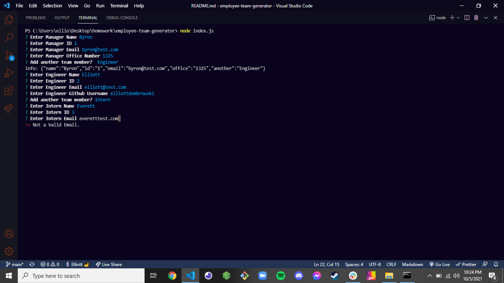
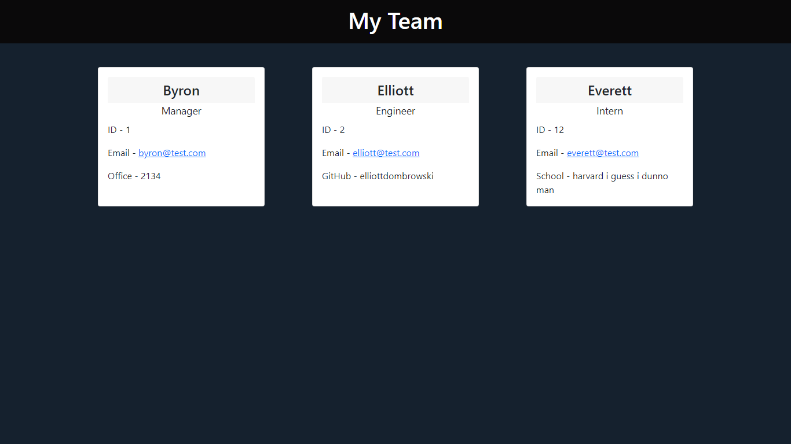

# TEAM PROFILE GENERATOR

### This application is a Team Profile Generator for an Employer to organize information about their team via the command line.

--- md

AS an Employer/Manager, I want to generate organized information about my team in a clear, concise website format.

WHEN I run the application, I want to be able to enter my name, employee ID, email, and office number.
THEN I will be prompted to add another team member if I choose.
WHEN I choose to add another team member, I will be prompted to enter their information.
WHEN I choose not to add another team member, my webpage will be generated.

---

## USAGE

### To use this application, run 'npm install' followed by 'node index.js' in your terminal window.

---

---

---

### The video below will demonstrate the application's usage.
https://drive.google.com/file/d/1NTGMx6RjmbNT1l5R1XOOiw6wfVZmytGs/view?usp=sharing